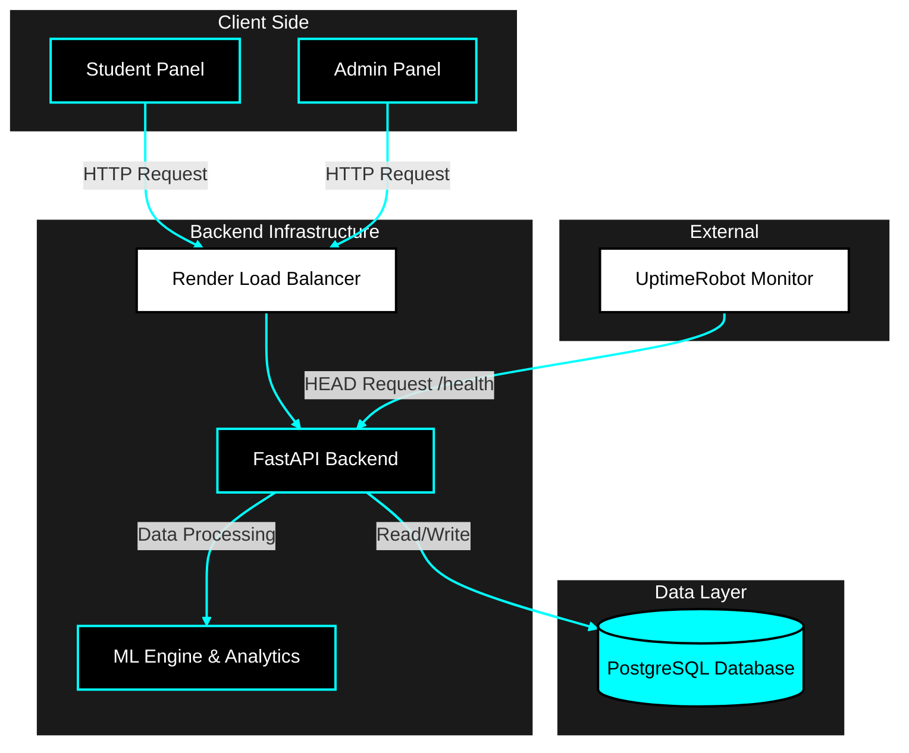
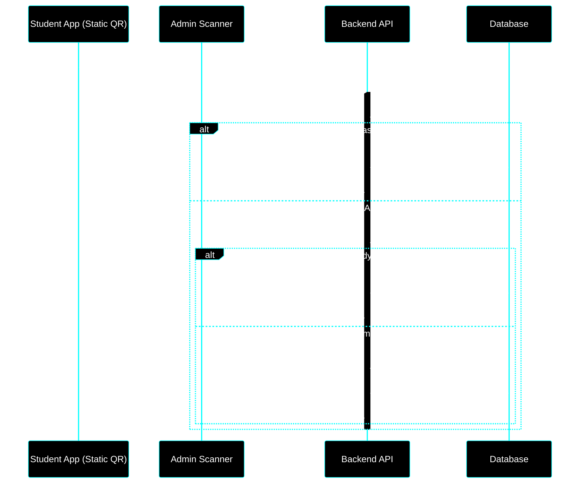
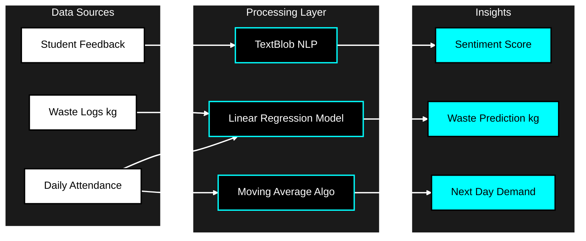
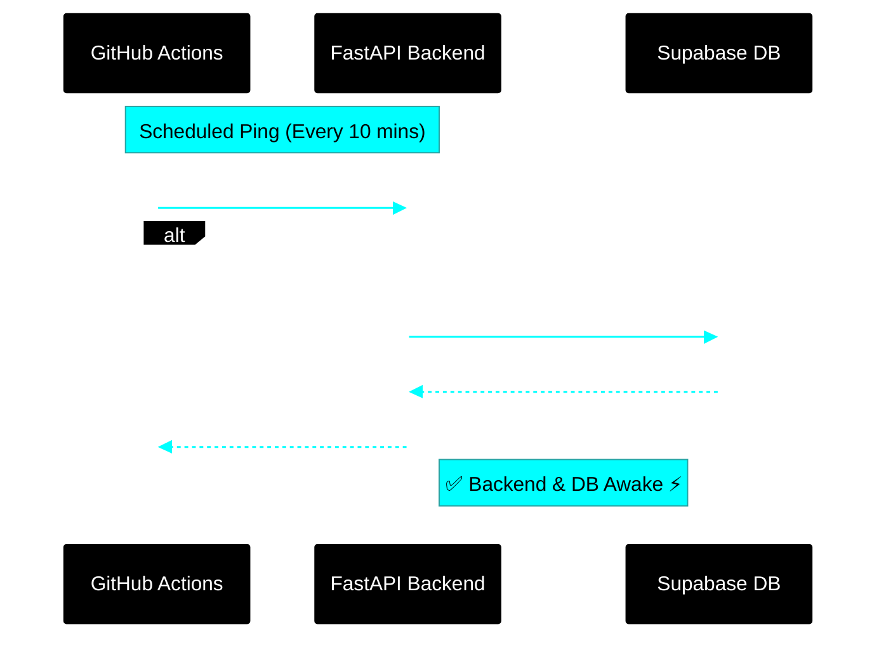

<div align="center">

# MessMate

### A Data-Driven Hostel Mess Management Platform

[](https://fastapi.tiangolo.com/)
[](https://vitejs.dev/)
[](https://www.postgresql.org/)
[](https://www.docker.com/)
[](https://python.org/)

<br/>

[](https://messmate-iiitu.vercel.app)
[](https://messmate-api.onrender.com/docs)
[](../../issues)
[](../../issues)


<br/><br/>


</div>


## 🎯 About

**MessMate** transforms traditional hostel mess management through intelligent automation and data analytics. Beyond basic management, the platform employs an **AI-driven Analytics Engine** that provides:

| Capability | Description |
|:---:|:---|
| 🥗 **Nutritional Intelligence** | AI-powered meal planning with macro/micronutrient tracking |
| 📈 **Demand Forecasting** | Offline ML pipeline engineering temporal features for precise attendance forecasting |
| ♻️ **Waste Reduction** | Linear Regression pipeline reducing baseline waste prediction error (MAE) by 27%+ |
| 💬 **Sentiment Analysis** | NLP-driven feedback processing for quality insights |

> **Impact Metrics:** Designed to serve 500+ students with <100ms API response times

---

## 🏗 System Architecture



---

## 💻 Tech Stack

<div align="center">

### Core Technologies

| Layer | Technology | Purpose |
|:-----:|:----------:|:--------|
| **Frontend** |  | Component-based UI with hooks |
| |  | 3D visualizations & animations |
| |  | Utility-first styling |
| **Backend** |  | Async REST API framework |
| |  | Data validation & serialization |
| **Database** |  | ACID-compliant relational DB |
| |  | ORM with type hints |
| **ML/AI** |  | Data manipulation & analysis |
| |  | ML models for forecasting |
| |  | NLP sentiment analysis |
| **Security** |  | Stateless authentication |
| |  | Password hashing (cost=12) |
| **DevOps** |  | Containerization |
| |  | Cloud deployment |

</div>

---

## ✨ Features

<div align="center">

<table>
<tr>
<td width="50%" valign="top">

### 🎓 Student Panel

| | Feature | Description |
|:-:|:--------|:------------|
| 📱 | **Digital Menu** | Browse daily/weekly menus with nutritional breakdown |
| 🥗 | **Nutrition AI** | AI-powered dietary insights and recommendations |
| ⏭️ | **Meal Opt-Out** | Skip meals & automatically receive rebates |
| 💬 | **Feedback** | Rate meals and submit detailed reviews |
| 🎫 | **QR Identity** | Unique QR code for attendance verification |
| 📊 | **Dashboard** | Personal stats and spending analytics |

</td>
<td width="50%" valign="top">

### 🔐 Admin Panel

| | Feature | Description |
|:-:|:--------|:------------|
| 📷 | **QR Scanner** | Real-time meal attendance tracking |
| 📊 | **Sentiment Dashboard** | NLP-powered feedback analysis |
| 📈 | **Predictive Analytics** | ML-driven demand forecasting |
| 🍽️ | **Menu Manager** | Full CRUD with nutrition data |
| ♻️ | **Waste Tracking** | Log and analyze food waste |
| 👥 | **User Management** | Student accounts & bulk ops |

</td>
</tr>
</table>

</div>

## 🏗 Workflow

### Smart QR Attendance Workflow


### ML & Analytics Pipeline


### Automated Keep-Alive Architecture



## Technical Implementation Highlights

### 1. Production ML Pipeline
Decoupled offline training from real-time inference. The system automatically engineers temporal features (rolling averages, lag waste) and serializes a scikit-learn pipeline (`joblib`) for sub-100ms API inference, logging all requests for telemetry.

### 2. Zero-Maintenance Keep-Alive
Engineered an automated endpoint pinged via GitHub Actions every 10 minutes. It executes a lightweight database query to prevent both the Render FastAPI container and Supabase database from sleeping due to free-tier inactivity rules.
```python
@app.get("/keep-alive")
def keep_alive(session: Session = Depends(get_session)):
    session.exec(text("SELECT 1;")) # Keeps DB pool active
    return {"status": "alive"}
```

## Getting started
### Prerequisites

- Python 3.9+
- Node.js 18+
- PostgreSQL 14+
- Docker (optional)
### Installation
1. **Clone the repository**
   ```bash
   git clone https://github.com/SujalAgrawal08/MessMate.git
   cd messmate
   ```
2. **Backend** 
   ```bash
   python -m venv venv
   source venv/bin/activate 
   pip install -r requirements.txt
   uvicorn main:app --reload
   ```

3. **Frontend**
   ```bash
   cd frontend
   npm install
   npm run dev
   ```
4. **Access the Application**
   * Frontend: http://localhost:5173
   * Backend API: http://localhost:8000
   * API Docs: http://localhost:8000/docs


## ☁️ Deployment
| Service | Platform | Purpose |
|---------|---------|-----------|
| Backend | Render | Containerized Python service |
| Frontend | Vercel | Static site hosting |
| Database | Render / Supabase | Managed PostgreSQL |
| Monitoring | UptimeRobot | 24/7 health checks |
  

<div align="center">

Made with ❤️ by Sujal Agrawal

</div>
