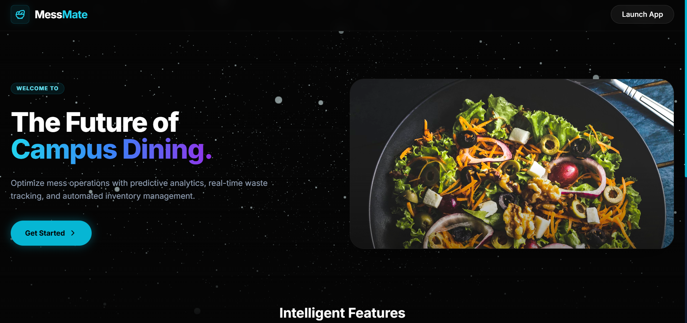
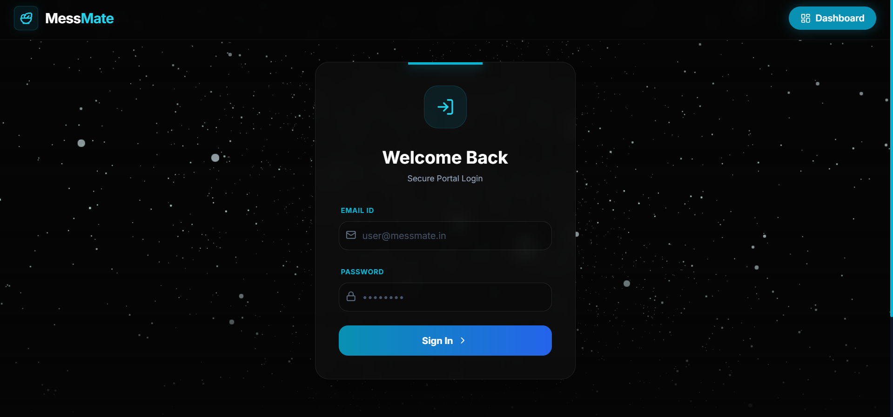

<div align="center">

# MessMate

### A Data-Driven Hostel Mess Management Platform

[](https://fastapi.tiangolo.com/)
[](https://vitejs.dev/)
[](https://www.postgresql.org/)
[](https://www.docker.com/)
[](https://python.org/)

<br/>

[](https://messmate-iiitu.vercel.app)
[](https://messmate-api.onrender.com/docs)
[](../../issues)
[](../../issues)




<br/><br/>



</div>


## 🎯 About

**MessMate** transforms traditional hostel mess management through intelligent automation and data analytics. Beyond basic management, the platform employs an **AI-driven Analytics Engine** that provides:

| Capability | Description |
|:---:|:---|
| 🥗 **Nutritional Intelligence** | AI-powered meal planning with macro/micronutrient tracking |
| 📈 **Demand Forecasting** | Linear regression models predicting meal attendance |
| ♻️ **Waste Reduction** | Predictive analytics reducing food waste by up to 30% |
| 💬 **Sentiment Analysis** | NLP-driven feedback processing for quality insights |

> **Impact Metrics:** Designed to serve 500+ students with <100ms API response times

---

## 🏗 System Architecture

```
         ┌─────────────────────────────────────────────────────────────────────────────────┐
         │                              CLIENT LAYER                                       │
         ├─────────────────────────────────────────────────────────────────────────────────┤
         │                                                                                 │
         │    ┌──────────────┐    ┌──────────────┐    ┌──────────────┐                     │
         │    │   Student    │    │    Admin     │    │   Mobile     │                     │
         │    │   Portal     │    │  Dashboard   │    │   (Future)   │                     │
         │    │  (React.js)  │    │  (React.js)  │    │              │                     │
         │    └──────┬───────┘    └──────┬───────┘    └──────────────┘                     │
         │           │                   │                                                 │
         │           └─────────┬─────────┘                                                 │
         │                     │ HTTPS                                                     │
         │                     ▼                                                           │
         ├─────────────────────────────────────────────────────────────────────────────────┤
         │                              API GATEWAY LAYER                                  │
         ├─────────────────────────────────────────────────────────────────────────────────┤
         │                                                                                 │
         │    ┌────────────────────────────────────────────────────────────────────────┐   │
         │    │                         FastAPI Application                            │   │
         │    │  ┌─────────────┐  ┌─────────────┐  ┌─────────────┐  ┌─────────────┐    │   │
         │    │  │    Auth     │  │    CORS     │  │    Rate     │  │   Request   │    │   │
         │    │  │ Middleware  │  │ Middleware  │  │  Limiter    │  │  Validator  │    │   │
         │    │  └─────────────┘  └─────────────┘  └─────────────┘  └─────────────┘    │   │
         │    └────────────────────────────────────────────────────────────────────────┘   │
         │                                                                                 │
         ├─────────────────────────────────────────────────────────────────────────────────┤
         │                              SERVICE LAYER                                      │
         ├─────────────────────────────────────────────────────────────────────────────────┤
         │                                                                                 │
         │    ┌─────────────┐  ┌─────────────┐  ┌─────────────┐  ┌─────────────────────┐   │
         │    │    User     │  │    Menu     │  │   Rebate    │  │     Analytics       │   │
         │    │  Service    │  │  Service    │  │  Service    │  │      Engine         │   │
         │    │             │  │             │  │             │  │  ┌───────────────┐  │   │
         │    │ • Auth      │  │ • CRUD      │  │ • Opt-out   │  │  │ ML Pipeline   │  │   │
         │    │ • Profile   │  │ • Schedule  │  │ • Calculate │  │  │ • Forecasting │  │   │
         │    │ • QR Gen    │  │ • Nutrition │  │ • History   │  │  │ • Sentiment   │  │   │
         │    └──────┬──────┘  └──────┬──────┘  └──────┬──────┘  │  │ • Clustering  │  │   │
         │           │                │                │         │  └───────────────┘  │   │
         │           │                │                │         └──────────┬──────────┘   │
         │           └────────────────┴────────────────┴────────────────────┘              │
         │                                        │                                        │
         ├────────────────────────────────────────┼────────────────────────────────────────┤
         │                              DATA ACCESS LAYER                                  │
         ├────────────────────────────────────────┼────────────────────────────────────────┤
         │                                        │                                        │
         │    ┌───────────────────────────────────┼───────────────────────────────────┐    │
         │    │                         SQLModel ORM                                  │    │
         │    │  ┌─────────────┐  ┌─────────────┐│┌─────────────┐  ┌─────────────┐    │    │
         │    │  │   Models    │  │   Schemas   │││  Repository │  │  Migrations │    │    │
         │    │  │             │  │  (Pydantic) │││   Pattern   │  │   (Alembic) │    │    │
         │    │  └─────────────┘  └─────────────┘│└─────────────┘  └─────────────┘    │    │
         │    └───────────────────────────────────┼───────────────────────────────────┘    │
         │                                        │                                        │
         │                                        ▼                                        │
         │                          ┌─────────────────────────┐                            │
         │                          │      PostgreSQL         │                            │
         │                          │    ┌───────────────┐    │                            │
         │                          │    │    Tables     │    │                            │
         │                          │    │  • users      │    │                            │
         │                          │    │  • menus      │    │                            │
         │                          │    │  • feedback   │    │                            │
         │                          │    │  • attendance │    │                            │
         │                          │    │  • rebates    │    │                            │
         │                          │    │  • waste_logs │    │                            │
         │                          │    └───────────────┘    │                            │
         │                          └─────────────────────────┘                            │
         │                                                                                 │
         └─────────────────────────────────────────────────────────────────────────────────┘
```

---

## Tech Stack

| Layer | Technologies |
|-------|--------------|
| **Frontend** | React.js, Three.js, Tailwind CSS |
| **Backend** | FastAPI (Python) |
| **Database** | PostgreSQL + SQLModel ORM |
| **Data Science** | Pandas, NumPy, Scikit-Learn |
| **NLP** | TextBlob (Sentiment Analysis) |
| **Auth** | JWT + Bcrypt |
| **DevOps** | Docker, UptimeRobot |

---

## ✨ Features

### Authentication Module
| Feature | Description |
|---------|-------------|
| Secure Login/Signup | JWT-based authentication with Bcrypt password hashing |
| Role-based Access | Separate flows for students and administrators |

### Student Panel
| Feature | Description |
|---------|-------------|
| Digital Menu | Browse daily/weekly menus with nutritional breakdown |
| Nutrition Analysis | AI-powered dietary insights and recommendations |
| Opt-Out & Rebate | Skip meals and automatically receive rebates |
| Feedback System | Submit and track meal feedback |
| QR Identity | Unique QR code for attendance verification |

### Admin Panel
| Feature | Description |
|---------|-------------|
| QR Attendance Scanner | Real-time meal attendance tracking |
| Sentiment Dashboard | NLP-powered feedback analysis with trends |
| Predictive Analytics | ML-driven waste forecasting and demand prediction |
| Waste Logging | Manual and automated waste tracking |
| Menu Management | Create and update digital menus |

---

## Technical Implementation Highlights

### Cold Start Fix
A specialized /health endpoint was engineered to accept HEAD requests from UptimeRobot, preventing the server from sleeping.
```python
@app.head("/health")
def health_check(): return {"status": "active"}
```

## Getting started
### Prerequisites

- Python 3.9+
- Node.js 18+
- PostgreSQL 14+
- Docker (optional)
### Installation
1. **Clone the repository**
   ```bash
   git clone https://github.com/SujalAgrawal08/MessMate.git
   cd messmate
   ```
2. **Backend** 
   ```bash
   python -m venv venv
   source venv/bin/activate 
   pip install -r requirements.txt
   uvicorn main:app --reload
   ```

3. **Frontend**
   ```bash
   cd frontend
   npm install
   npm run dev
   ```
4. **Access the Application**
   * Frontend: http://localhost:5173
   * Backend API: http://localhost:8000
   * API Docs: http://localhost:8000/docs


## ☁️ Deployment
| Service | Platform | Purpose |
|---------|---------|-----------|
| Backend | Render | Containerized Python service |
| Frontend | Vercel | Static site hosting |
| Database | Render / Supabase | Managed PostgreSQL |
| Monitoring | UptimeRobot | 24/7 health checks |
  

<div align="center">

Made with ❤️ by Sujal Agrawal

</div>
